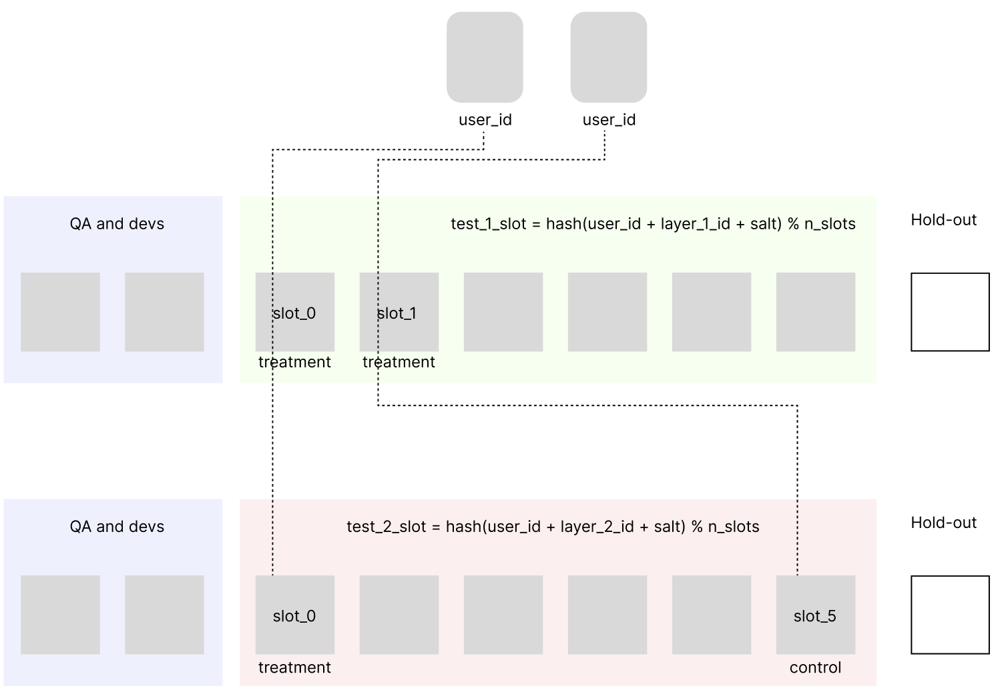

# Реализация соленого хэширования для сплитования по группам

Данный раздел реализует метод, а в последующем даны методы стастических проверок через Колмогорова-Смирнова (KS-test) и кси-квадрат для проверки корректности метода.

**SALT Split** - это метод разделения пользователей на группы для A/B-тестирования. При техническом реализации, всегда нужно отказываться от простого рандома (или лучше вообще не реализовать такое) в пользу надежного детерминированного хэширования.

### В чем проблема обычного рандома?
Использование обычного генератора случайных чисел в реальных продуктах создает риски:
1.  **Перетекание юзеров:** Юзер может получить тритмент один раз, а потом оказаться в контрольной группе. Это не просто портит пользовательский опыт,но и **тесты становятся невалидны**
2.  **Сложность отладки:** Невозможно повторить баг, если мы не знаем, в какой группе был пользователь в конкретную секунду.
3.  **Конфликты тестов:** Запуск двух тестов одновременно может привести к пересечению аудиторий и искажению данных.

---

### Как это работает
Тут дана реализация простого SALT хэширования. Это гарантирует, что пользователь строго соотносится только к одной группе в рамках своего бакета.

видно как User ID проходит через разные слои. В Test 1 он попал в Treatment, а в Test 2 - в Control. Это независимые процессы

---

### Ключевые принципы

#### 1. Стабильность (sticky bucketing)
Мы используем юзер айди(UUID). Это значит, что для конкретного пользователя результат всегда одинаковый.

#### 2. Параллельные тесты
Чтобы запускать много тестов одновременно, мы используем параметр `layer_id`.
* Каждый тест - это новый слой.
* Распределение в одном слое **никак не влияет** на распределение в другом. 

#### 3. Соль
Уникальная строка для каждого теста. Она перемешивает пользователей заново. Если в Тесте А вы попали в контрольную группу, это не значит, что в Тесте Б вы тоже будете в контроле.

---

### Безопасность и контроль

* **Контрольная группа:** Следует оставить 5-10% пользователей, которых не затрагивают эксперименты, чтобы следить за глобальными метриками здоровья продукта. При первом запуске лучше следовать 50/50
* Отдельные слоты для команды. Добавлю реализацию чуть позже
* **Плавная раскатка:** При использовании таких систем как Amplitude, всегда нужно проводить плавную раскатку и проверять как правильную фронтовую аттрибуцию, так и само сплитование через A/A тест.

### SRM 
Следует проверять на **Sample Ratio Mismatch**.
Если мы планировали деление 50/50, а получилось 48/52 - тест невалиден и нужно разбираться с причинами. Как правило, они технические

